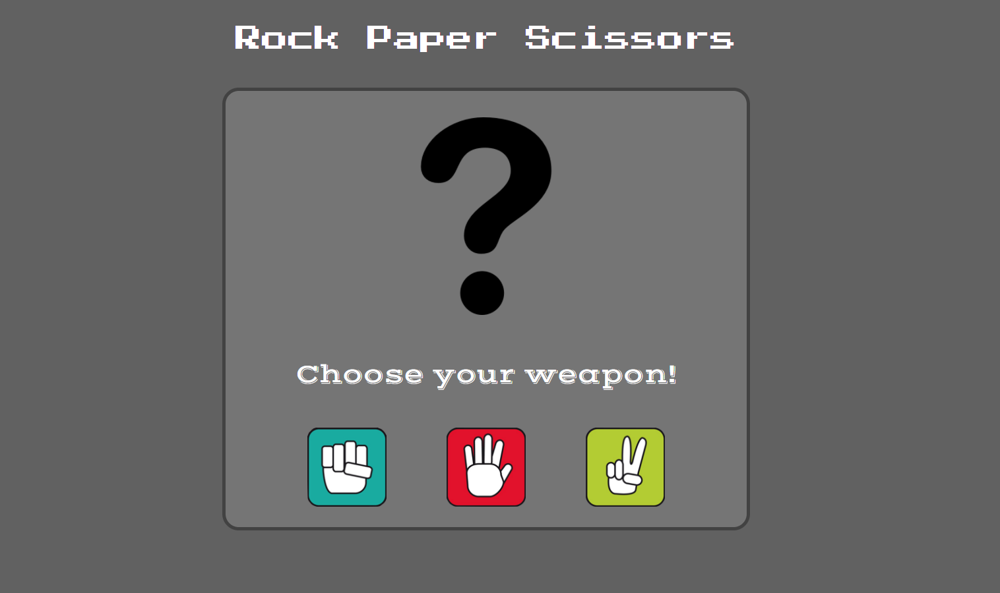

# :fist:Rock :hand:Paper :v:Scissors

[`Play the game`](https://rock-paper-scissors-lm99.herokuapp.com/)

This is a web app for the **Rock Paper Scissors** game. Anyone can **install it** and **play it**!



## Requirements

[`NodeJS`](https://nodejs.org/en/) - any version

## Instalation

```sh
npm install
```

## Run

```sh
npm start
```

Go to [localhost:3000](http://localhost:3000).

## Built with

- [NodeJS](https://nodejs.org/en/) v14.8.0 - Backend framework

## License

Distributed under the [MIT License](https://choosealicense.com/licenses/mit/). See [`LICENSE`](LICENSE) for more information.

## Author

- **Luis Marques** - [LuisMarques99](https://github.com/LuisMarques99)
